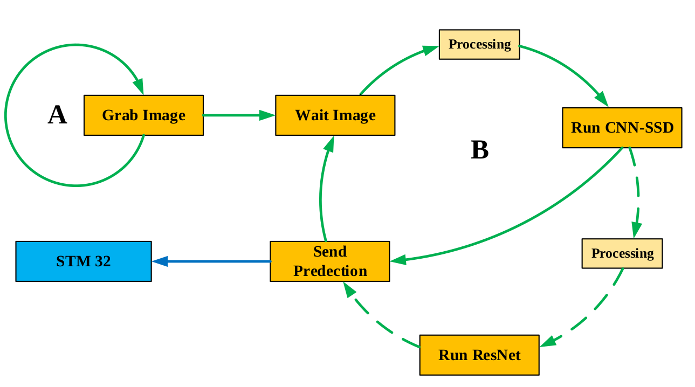
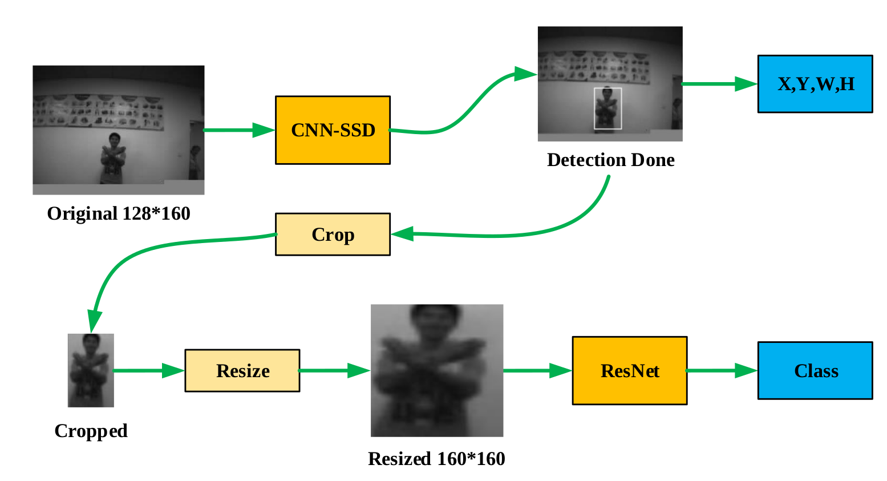

# CNN-SSD + ResNet Workflow
2021/11/23  HaolinChen  
PC Input: 324x244 gray pictures.  
Camera Input: 324x244 gray pictures.  

### Test Frame Performance:

| FC/CL (MHZ) | No Gesture CL Cycles(M) | No Gesture Frames | Gesture CL Cycles(M) | Gesture Frames |
| :---------: | :---------------------: | :---------------: | :------------------: | :------------: |
|   250/50    |       11.17/9.69        |     4.47/5.16     |     18.35/16.80      |   2.72/2.98    |
|   250/75    |       11.40/9.88        |     6.58/5.59     |     18.65/17.12      |   4.02/4.38    |
|   250/100   |       11.65/10.11       |     8.58/9.89     |     19.05/17.53      |   5.25/5.70    |
|   250/120   |       11.78/10.28       |    10.19/11.57    |     19.36/17.82      |   6.20/6.73    |

### Test Dataset Information:

| Label |   Text   | Total Numbers Test | Total Numbers Val |
| :---: | :------: | :----------------: | :---------------: |
|   0   | backward |         59         |        48         |
|   1   |   down   |         64         |        40         |
|   2   | forward  |         59         |        37         |
|   3   |   left   |         63         |        42         |
|   4   |  right   |         62         |        43         |
|   5   |    up    |         66         |        46         |

### Different Feature Map Usage Analysis:

| Label |   Text   | Total Numbers | Map 0 Used Times | Map 1 Used Times | Map 2 Used Times | Map 3 Used Times |
| :---: | :------: | :-----------: | :--------------: | :--------------: | :--------------: | :--------------: |
|   0   | backward |      59       |        26        |        57        |        37        |        0         |
|   1   |   down   |      64       |        16        |        56        |        53        |        2         |
|   2   | forward  |      59       |        11        |        51        |        46        |        1         |
|   3   |   left   |      63       |        12        |        58        |        55        |        2         |
|   4   |  right   |      62       |        14        |        56        |        48        |        5         |
|   5   |    up    |      66       |        12        |        59        |        62        |        6         |
| Total |          |      373      |    91 (24.4%)    |   337 (90.3%)    |   301 (80.7%)    |    16 (4.3%)     |

### Detection Rate Test:

| Confidence | backward |   down   | forward  |   left   |  right   |    up    |  Total   |
| :--------: | :------: | :------: | :------: | :------: | :------: | :------: | :------: |
|    0.25    | 0.644068 | 0.609375 | 0.305085 | 0.380952 | 0.483871 | 0.863636 | 0.547831 |
|    0.15    | 0.898305 | 0.937500 | 0.711864 | 0.714286 | 0.935484 | 0.984848 |  0.8637  |

### Detection Rate Val:

| Confidence | backward | down  | forward | left  | right |  up   | Total |
| :--------: | :------: | :---: | :-----: | :---: | :---: | :---: | :---: |
|    0.15    |          |       |         |       |       |       |       |

### Accuracy:

| Confidence | backward |   down   | forward  |   left   |  right   |    up    | Total |
| :--------: | :------: | :------: | :------: | :------: | :------: | :------: | :---: |
|    0.25    |    0     | 0.125000 | 0.152542 | 0.206349 | 0.112903 | 0.393939 |       |

### Workflow:

### Picture Processing Strategy:

1.Fill the blank space with gray scale pixel, like 128.

2.Resize the cropped box directly.

