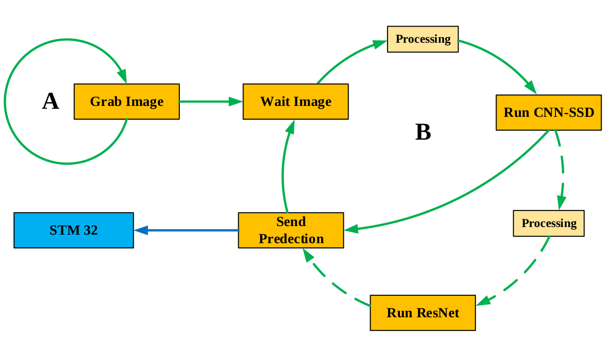
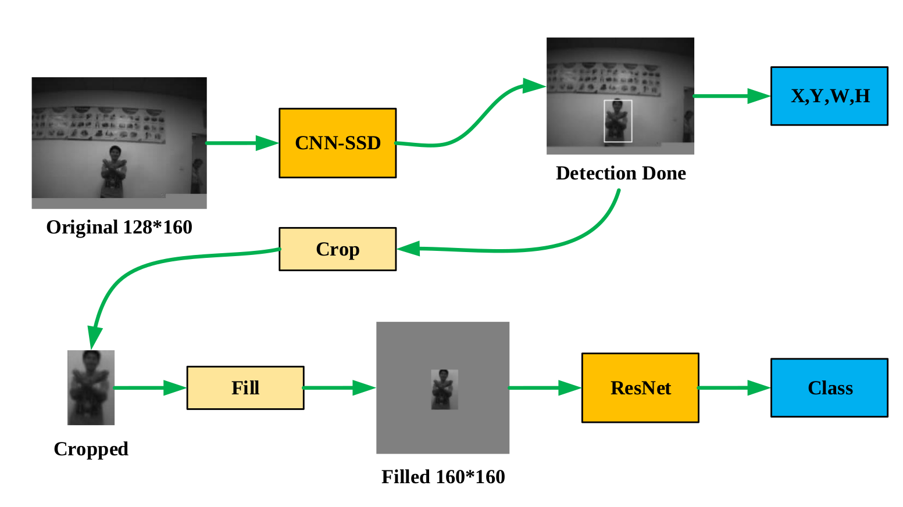
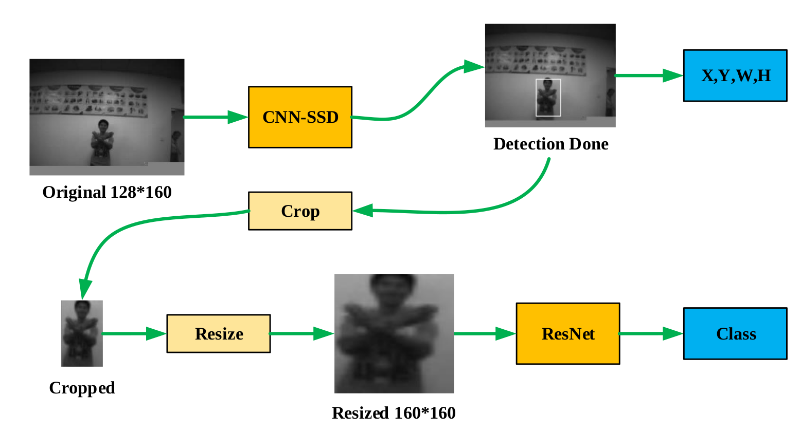

# CNN-SSD + ResNet Workflow
2021/11/18  HaolinChen  
PC Input: 324x244 gray pictures.  
Camera Input: 324x244 gray pictures.  

### Done:
1.Test pictures from PC.  
2.Tested on gvsoc and gap8.  
2.Tested on camera.  
2.Fixed some BUGs.  
1.Improve performance.  

### Test Frame Performance:

| FC/CL (MHZ) | No Gesture CL Cycles(M) | No Gesture Frames | Gesture CL Cycles(M) | Gesture Frames |
| :---------: | :---------------------: | :---------------: | :------------------: | :------------: |
|   250/50    |          11.17          |       4.47        |        18.35         |      2.72      |
|   250/75    |          11.40          |       6.58        |        18.65         |      4.02      |
|   250/100   |          11.65          |       8.58        |        19.05         |      5.25      |
|   250/120   |          11.78          |       10.19       |        19.36         |      6.20      |

### Test Dataset Information:

| Label |   Text   | Total Numbers |
| :---: | :------: | :-----------: |
|   0   | backward |      59       |
|   1   |   down   |      64       |
|   2   | forward  |      59       |
|   3   |   left   |      63       |
|   4   |  right   |      62       |
|   5   |    up    |      66       |

### Detection Rate:

| Confidence | backward |   down   | forward  |   left   |  right   |    up    |  Total   |
| :--------: | :------: | :------: | :------: | :------: | :------: | :------: | :------: |
|    0.25    | 0.644068 | 0.609375 | 0.305085 | 0.380952 | 0.483871 | 0.863636 | 0.547831 |
### Accuracy:

| Confidence | backward |   down   | forward  |   left   |  right   |    up    | Total |
| :--------: | :------: | :------: | :------: | :------: | :------: | :------: | :---: |
|    0.25    |    0     | 0.125000 | 0.152542 | 0.206349 | 0.112903 | 0.393939 |       |

### Workflow:

### Picture Processing Strategy:

1.Fill the blank space with gray scale pixel, like 128.

2.Resize the cropped box directly.

