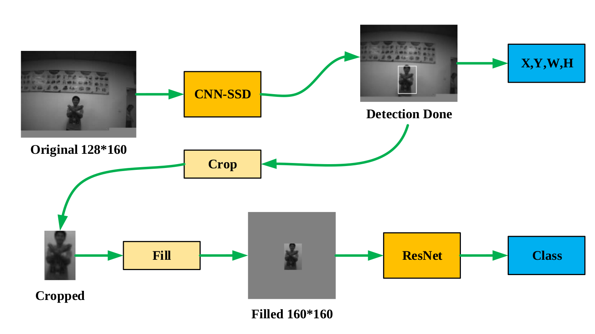
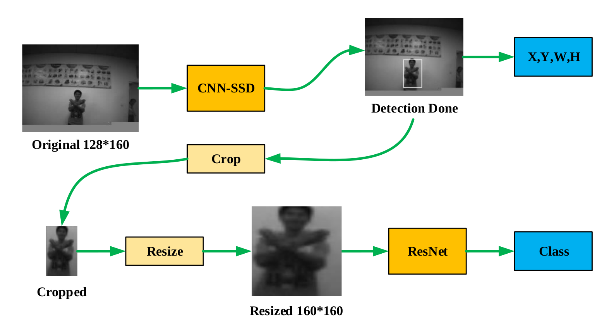

# CNN-SSD + ResNet Workflow
2021/09/27  
Input: 128*160 gray pictures. 

### Done:
1.Test pictures from PC.  
2.Tested on gvsoc and gap8.  

### Not Done:
1.Test pictures from camera.  
2.Improve performance.  

### Workflow:

### Picture Processing Strategy:

1.Fill the blank space with gray scale pixel, like 128.

2.Resize the cropped box directly.

